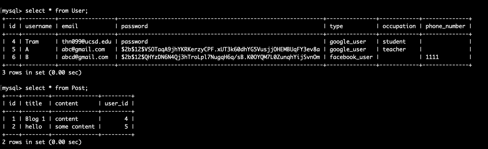

# Description

This project is my first attempt to learn Flask. I built this as a back-end component of a blogging application, which consists of data storage in MySQL and API to expose user data. Users can create account, sign in, create posts, like other's posts. There are three ways to sign in: sign in with a user name and password, sign in with Google account and sign in with Facebook account. 

All main components are in `blog_project` folder:

`__init__.py`: import project dependencies and set up MySQL database

`models.py`: data schema for User, Post, PostLike, GoogleUser (inherit from User), FacebookUser (inherit from User)

`routes.py`: API endpoints

/

/home

/login

/logout

/signup/facebook

/signup/google

/posts

/posts/<int:post_id>

/posts/<int:post_id>/like

/posts/<int:post_id>/number_of_likes

/posts/<int:post_id>/likes

/account


# Set up

Use `pip install` to get required packages:

`pip install flask sqlalchemy flask-alchemy flask-bcrypt pymysql flask-login`


# Run

```
$ export FLASK_APP=run.py
```

```
$ flask run
```

By default, service will be running on `http://127.0.0.1:5000/`

# Test

Use curl command to test endpoint:

Ex:

To create a Google user account:

```
$ curl -i -H "Content-Type: application/json" -X POST -d '{"email":"abc@gmail.com", "password":"1234", "username":"A"}' http://127.0.0.1:5000/signup/google
```

To create a Facebook user account:

```
$ curl -i -H "Content-Type: application/json" -X POST -d '{"email":"abcd@gmail.com", "password":"1234", "username":"B"}' http://127.0.0.1:5000/signup/facebook
```

To test endpoints that require user login, provide `--cookie "session=<encoded session>" ` option in your `curl` command

Ex:

You get a session encoded string when logging in:

```
$ curl -i -H "Content-Type: application/json" -X POST -d '{"email":"abc@gmail.com", "password":"1234"}' http://127.0.0.1:5000/login
HTTP/1.0 200 OK
Content-Type: application/json
Content-Length: 24
Vary: Cookie
Set-Cookie: session=<encoded session>; HttpOnly; Path=/
Server: Werkzeug/1.0.1 Python/3.6.0
Date: Mon, 08 Jun 2020 10:29:47 GMT
```

Provide that encoded string in subsequent calls until logging out:

Ex:

To get user information:

```
$ curl --cookie "session=<encoded session>" http://127.0.0.1:5000/account
```

To update phone number (for Facebook user):

```
$ curl --cookie "session=<encoded session>" -i -H "Content-Type: application/json" -X PUT -d '{"phone_number":"111"}' http://127.0.0.1:5000/account
```

To update occupation number (for Google user):

```
$ curl --cookie "session=<encoded session>" -i -H "Content-Type: application/json" -X PUT -d '{"occupation":"student"}' http://127.0.0.1:5000/account
```

To get all posts (home page):

```
$ curl --cookie "session=<encoded session>" http://127.0.0.1:5000/
```

To see current user posts:

```
$ curl --cookie "session=<encoded session>" http://127.0.0.1:5000/posts
```

To see a particular post:

```
$ curl --cookie "session=<encoded session>" http://127.0.0.1:5000/posts/<int:post_id>
```

To create a new post:

```
$ curl --cookie "session=<encoded session>" -i -H "Content-Type: application/json" -X POST -d '{"title":"a title", "content":"some content"}' http://127.0.0.1:5000/posts
```

To delete a post:

```
$ curl --cookie "session=<encoded session>" -X DELETE http://127.0.0.1:5000/posts/<int:post_id>
```

To like a post:

```
$ curl --cookie "session=<encoded session>" http://127.0.0.1:5000/posts/<int:post_id>/like
```

To get list of users who like a post:

```
$ curl --cookie "session=<encoded session>" http://127.0.0.1:5000/posts/<int:post_id>/likes
```

To get the number of people who liked a post:

```
$ curl --cookie "session=<encoded session>" http://127.0.0.1:5000/posts/<int:post_id>/number_of_likes
```

To logout

```
$ curl --cookie "session=<encoded session>" http://127.0.0.1:5000/logout
```

To see how data is updated, run queries on python shell or run mySQL commands to display data:


